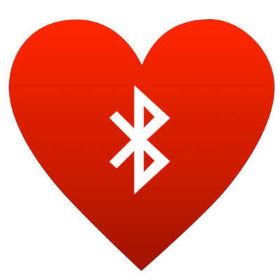

# BLEHeartRate

BLEHeartRate is a tiny iOS-App measuring your HeartRate via a Bluetooth LE Sensor and giving you the possibility to add the measurements to Health.app via HealthKit.

Requires iOS8. Work in progress.